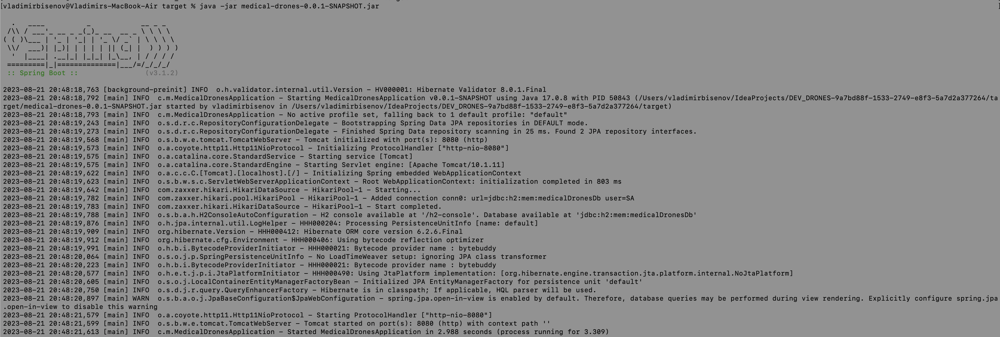
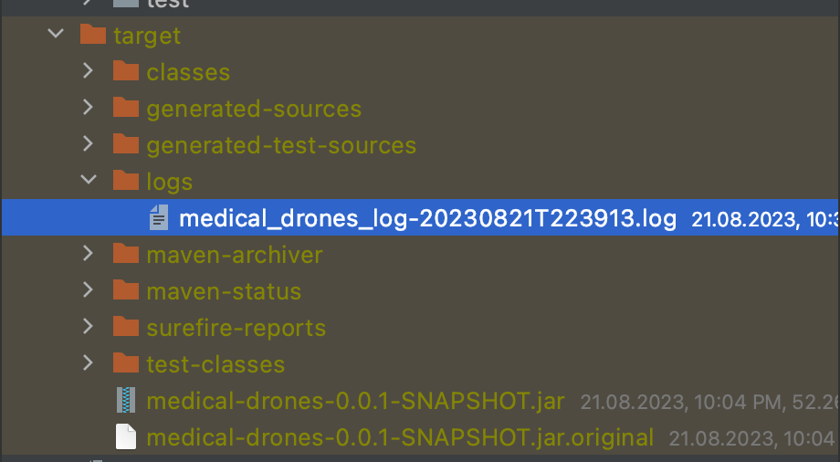
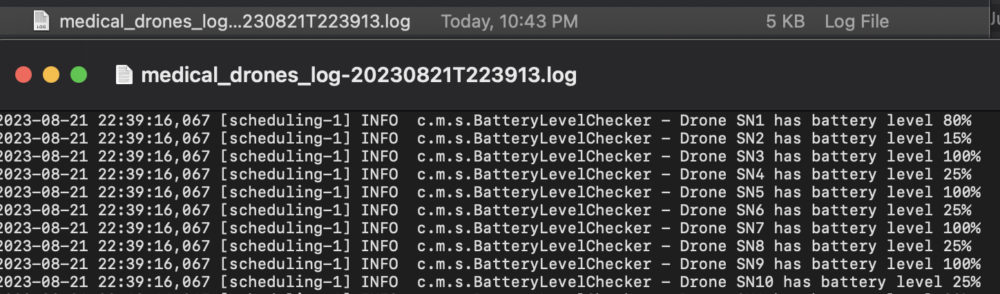
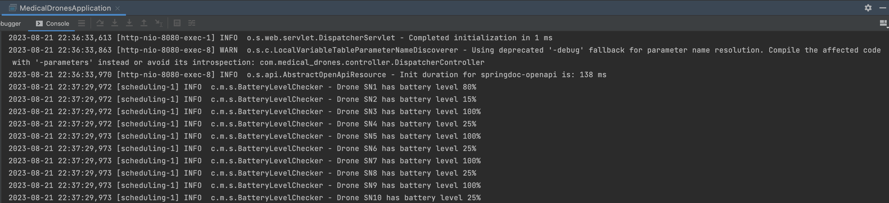
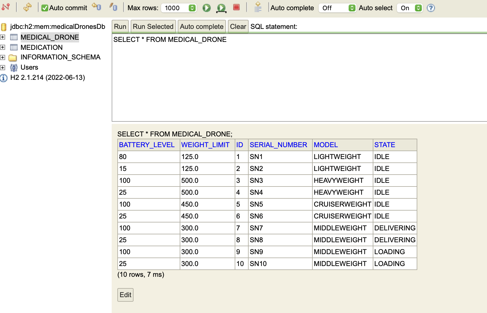
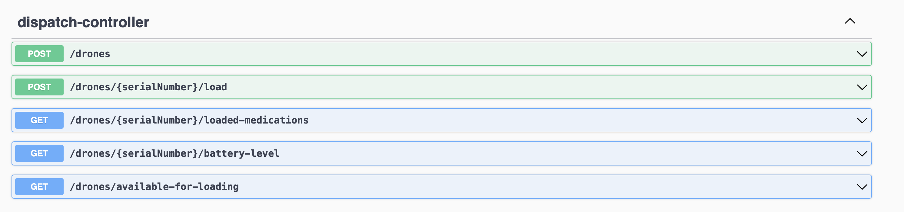
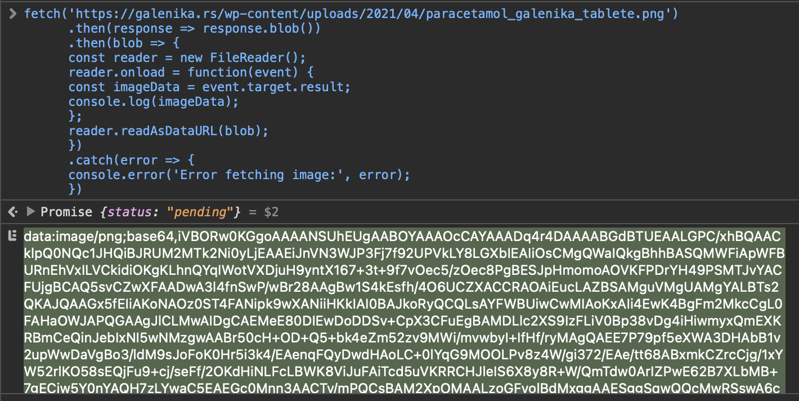
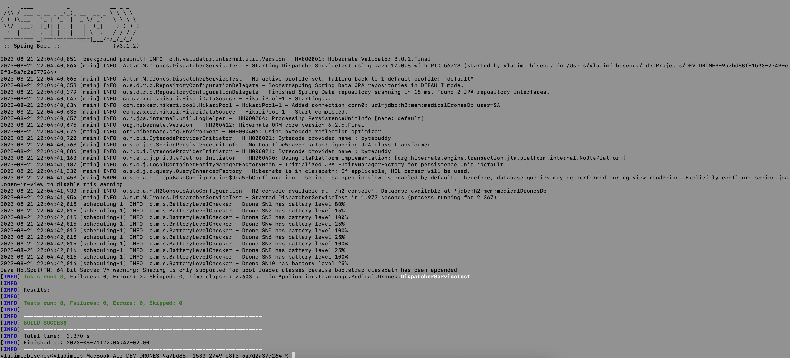

## Medical Drones

---

:scroll: **START**

## I. How to build

---

Prerequisites: You have to install Java 17 and Maven. Here is quick instruction:

### Installing Java 17 and Maven

1. **Java 17:**
   - Download and install: [Java SE 17](https://www.oracle.com/java/technologies/javase-downloads.html)
2. **Maven:**
   - Download and install: [Apache Maven](https://maven.apache.org/download.cgi)
   - Set `MAVEN_HOME` environment variable to Maven's installation path.

3. **Adding to System PATH:**
   - **Java 17:**
      - Windows: [Add to PATH](https://www.architectryan.com/2018/03/17/add-to-the-path-on-windows-10/)
      - macOS and Linux: `export JAVA_HOME=/path/to/java-17`
   - **Maven:**
      - Windows: Add Maven `bin` to PATH.
      - macOS and Linux: `export PATH=$PATH:/path/to/maven/bin`

4. **Verify Installations:**
   - Open a new terminal/command prompt.
   - Check Java 17: `java -version`
   - Check Maven: `mvn -v`

## II. How to run

When Maven & Java downloaded & set, it's time to build & run :)

1. **Build:**
    - Navigate to the `/DEV_DRONES-UUID` directory.
    - Run the command: `mvn clean install`

2. **Run:**
    - Go to the `/DEV_DRONES-UUID/target` directory.
    - Find the `medical-drones-0.0.1-SNAPSHOT.jar` file there.

3. **Execute the JAR:**
    - In the `/DEV_DRONES-UUID/target` directory, run:
      `java -jar medical-drones-0.0.1-SNAPSHOT.jar`
      
#### If everything correct you will see next logs in terminal:

---

## III. How to work with project

**Once application started you could see log files in `/logs` the same directory.** 

In our case `/DEV_DRONES-UUID/target/logs` will contain logs from periodical task, which track battery-level on drones.

The same logs you can see in application console:

1. **H2 Console:** 
   You can now navigate through you browser to `localhost:8080/h2-console` (login and password default).
Here you can see created data structure, and manipulate with data. Here you can also see preloaded data:

2. **Swagger:**
   Visit also `localhost:8080/swagger-ui/index.html`. Here you can see & try implemented API.

   

- `POST /drones` to create a drone.
- `GET /drones/{serialNumber}/loaded-medications` to retrieve medications loaded onto a drone identified by `serialNumber`.
- `GET /drones/{serialNumber}/battery-level` to retrieve the battery level of a drone identified by `serialNumber`.
    - For future enhancements, an API to track the actual battery level of the drone might be added.
- `GET /drones/available-for-loading` to receive a list of drones that can be loaded with new medications.
    - To prevent a drone from entering the LOADING state when the battery level is **below 25%**,
      the returned list will not include drones with a battery level of 24% or less.
    - Additionally, fully loaded drones will not appear in this list if their weight limit has already been reached.

- `POST /drones/{serialNumber}/load` to load a drone identified by `serialNumber` with medications.
  This API leaves the drone in a `LOADING` status.
    - For future enhancements, an API to move the drone to a destination place, which would change drone state 
      to `DELIVERING` and further might be added.
    - **Important thing: images should be passed in Base64 encoding format.** For test you could use 
      [online endocer](https://base64.guru/converter/encode/image) and pass value as string to API.
    
     **Here is code snippet for future front-end application how to convert image to Base64:**
  
      fetch('YOUR_LINK_TO_IMAGE_HERE')
      .then(response => response.blob())
      .then(blob => {
      const reader = new FileReader();
      reader.onload = function(event) {
      const imageData = event.target.result;
      console.log(imageData);
      };
      reader.readAsDataURL(blob);
      })
      .catch(error => {
      console.error('Error fetching image:', error);
      })
    
 **Example of usage** : 

___

## III. How to test 

For manual testing or Front-End development you can use Swagger from previous step, or the same API from Postman etc.

1. **For manual testing:**
    - Use Swagger from previous section.
    - Use the same API's with Postman etc.
2. **For unit testing:**
    - Navigate to the `/DEV_DRONES-UUID` directory.
    - Run the command: `mvn test`. You will get result:

:scroll: **END** 
